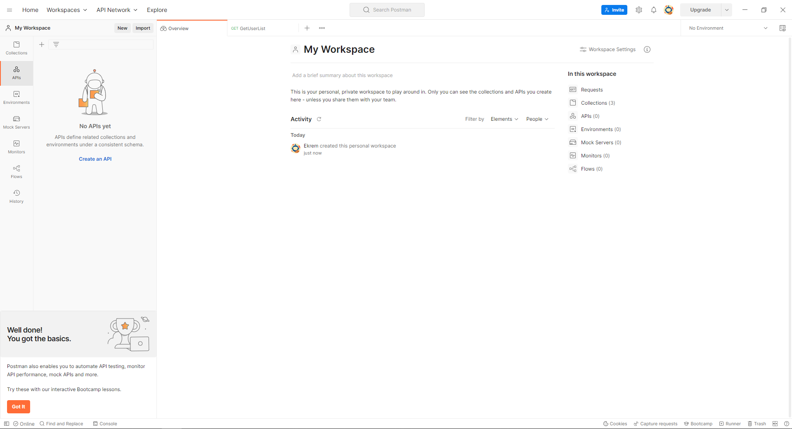
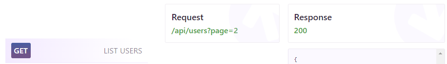
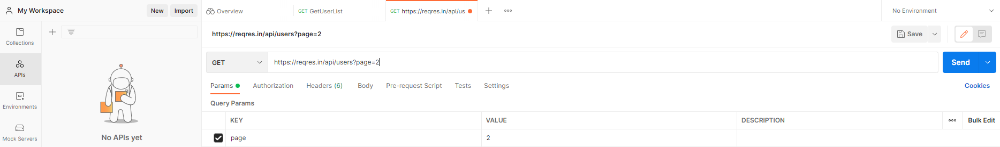
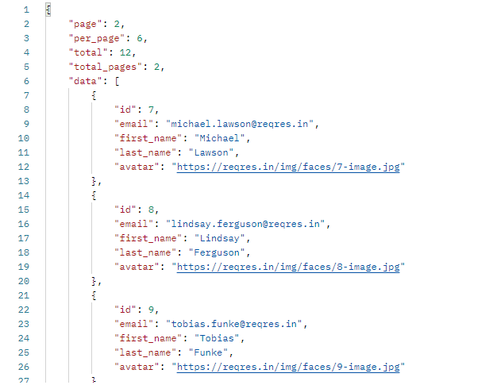
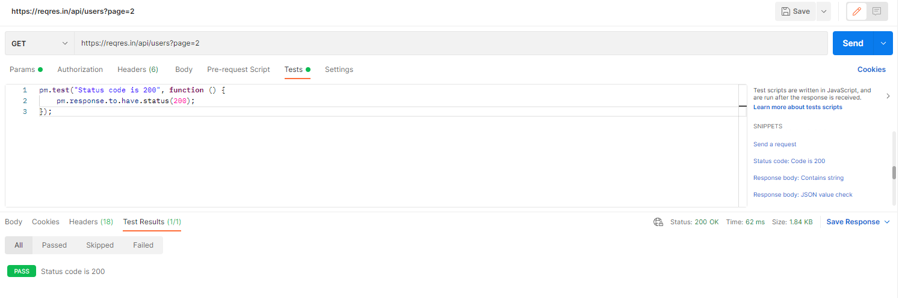

## Temel API Uygulaması - GET Request

Postman ilk açıldığında aşağıdaki gibi bir ekran gelecektir.

<figure>
    
    <figcaption>Postman Homescreen.</figcaption>
</figure>

---

Daha sonraki örnek olarak ilk API uygulaması için [ReqRes](https://reqres.in/) sitesini kullandım.
Buradaki **list user** kısmını çektim.\
Bunun için *list user* ifadesinin yanında bulunan **get**'e tıkladıktan sonra api sayfası açılacaktır.

<figure>
    
    <figcaption>List User.</figcaption>
</figure>

Buradaki;
* request ifadesi sorgulama adresidir
* response ise yanıt ifadesidir.

---

Daha sonra postman uygulaması açılarak ilk API eklenir.

<figure>
    
    <figcaption>Postman.</figcaption>
</figure>

* Bunun için sağ üst taraftaki **+** işaretine basılrak yeni sayfa açılır
* Get ifadesinin yanına sorgulanacak api olan *https://reqres.in/api/users?page=2* ifadesi yazılır.
    * Bu ifade aynı şekilde yöntemin adı olarak üst tarafta da gözükecektir.
* Params: İlgili parametreler kısımdır.
* Authorization: Sayfada izin gerekli ise ilgili izin seçimi.
    * Bu uygulamada olmadığı için NoAuth seçimi yapılır.
* Headers: API herhangi bir headers ihtiyaç duyuyorsa buradan eklenir.
* Body: Post veya put request varsa buradadır.
* Pre-request script: İstek gönderilmeden önce bu kısım çalıştırılır eğer istenirse.
* Test: Herhangi bir doğrulama yapılacak ise test kısmına eklenir.

---

Mavi kutu içindeki *Send* ifadesine tıklanıldığı zaman bu istek gönderilir ve sonuç ekrana döndürülür.

<figure>
    
    <figcaption>Request Response</figcaption>
</figure>

Elde edilen çıktıya bakıldığı zaman demo sayfasındaki sonucun aynısının elde edildiği görülecektir.

---

Test tarafının çalışma kısmı da aşağıda gösterilmiştir.

<figure>
    
    <figcaption>Test Response</figcaption>
</figure>

* Bir önceki durumdan farklı olarak bu sefer **Tests** kısmı açılarak sağ taraftaki hazır test kod bloklarından istenilen eklenir.
    * Durum kodunu kontrol etme kodunu ekledim.
* Buna göre Test Results kısmında da *Passed* ifadesi sonuç olarak dönmüştür.