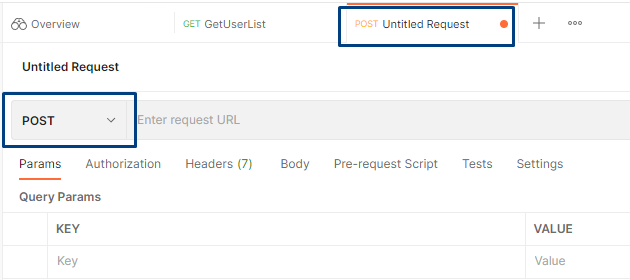
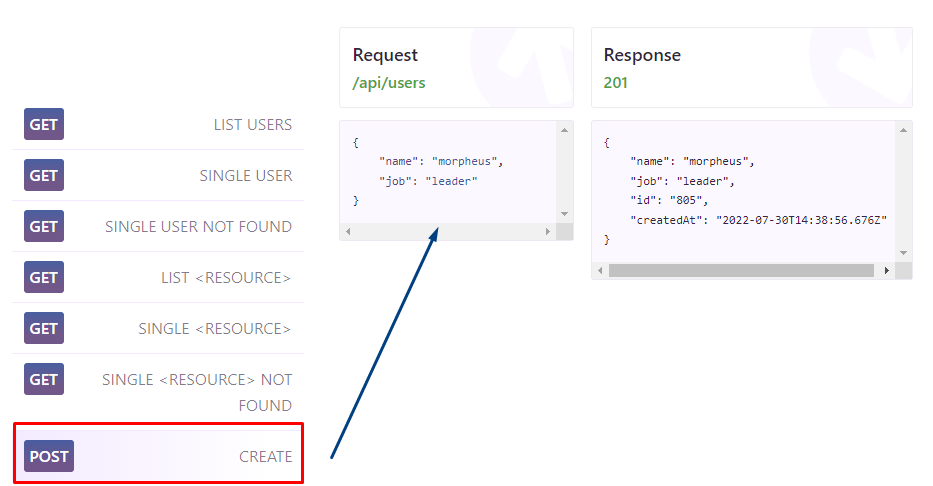
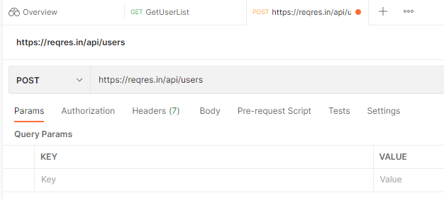
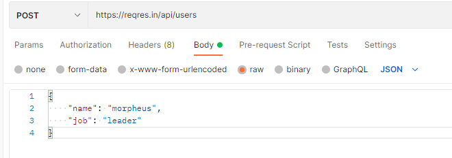
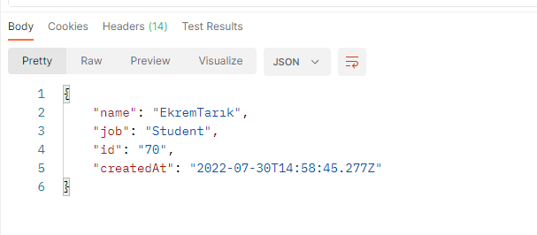

## Temel API Uygulaması - Post

Bu çalışmada ise post kullanımı üzerine bir çalışma gerçekleştirildi.

Bu sefer Postman uygulamasında yeni bir request açılır.

<figure>
    
    <figcaption>New Request.</figcaption>
</figure>

* Buradaki tip otomatik olarak Get olarak belirlidir. 
* Sol alttaki mavi kutu ile belirtili yerden seçim yapılarak **POST** olarak değiştirilir.

---

Ardından örnek uygulama sitesinde [ReqRes](https://reqres.in/) aşağı doğru inilerek post seçeneği bulunur.

<figure>
    
    <figcaption>New Request.</figcaption>
</figure>

* Seçim yapıldığı zaman Post ifadesi okla gösterilen bir çıktıyı döndüğü ekranda gösterilir.
* Request bloğu altındaki yeşil ile belirtilen [/api/users](https://reqres.in/api/users) ifadesine tıklanır.
  * Bu sayfadaki url kopyalanır ve postman'deki ilgili url kısmına yapıştırılır.

---

İlk bakışta aşağıdaki gibi olacaktır.

* Herhangi bir parametresi, authorization, gizli tutulan sabit header hariç başka bir header'a sahip olmayacaktır.

<figure>
    
    <figcaption>First View of Post.</figcaption>
</figure>

---

**Body** kısmına girilip burada da **raw** seçeneği işaretlenir

<figure>
    
    <figcaption>Adding Body to Post.</figcaption>
</figure>

* Bu kısıma iki üst taraftaki figürdeki mavi ok ile gösterilen body kısmı eklenir.
* Ayrıca bu JSON biçiminde olduğundan dolayı sağ taraftaki açılır menüdeki *text* ifadesi *JSON* seçeneği ile değiştirilir.
  * Bu durumda yazıların renklerinin değiştiği görülecektir.
* Buradaki name ve job değişkenlerindeki değerler değiştirilebilir.

---

BasicApi uygulamasında olduğu gibi sağ taraftaki **Send** ifadesi ile istek gönderilir.

<figure>
    
    <figcaption>Result with Post.</figcaption>
</figure>

* ❗❕❗ Bir önceki figürde bulunan değişken değerlerini değiştirdim.
  * Değişiklik yapılabilebileceğini bahsetmiştim.
* Çıktı olarak isim ve öğrenci bilgisini ayrıca Kimlik numarası ve oluşturulma bilgilerini de sonuç olarak döner.

