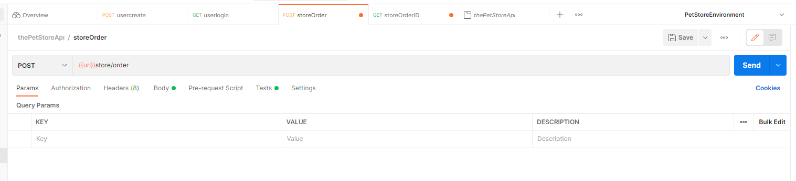
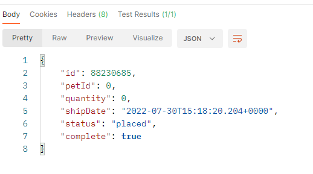
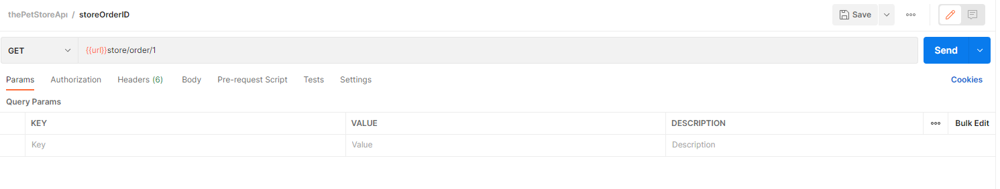
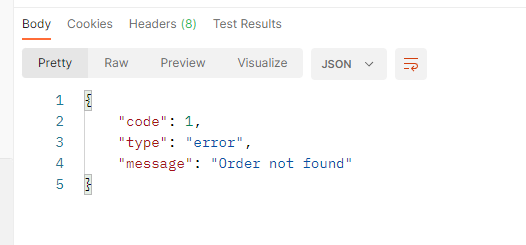
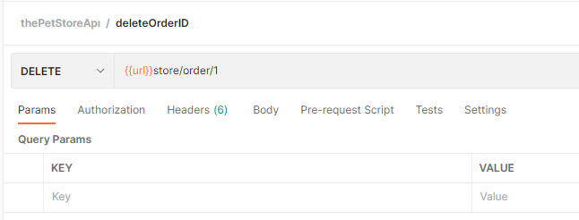
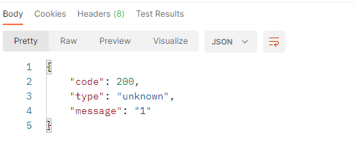
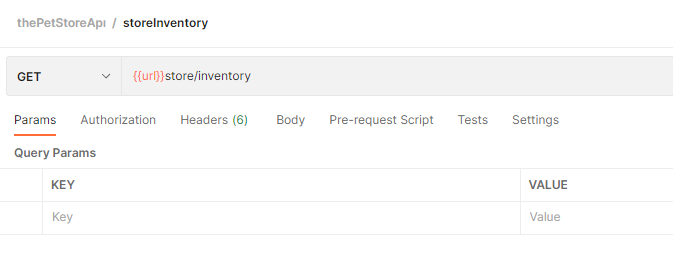
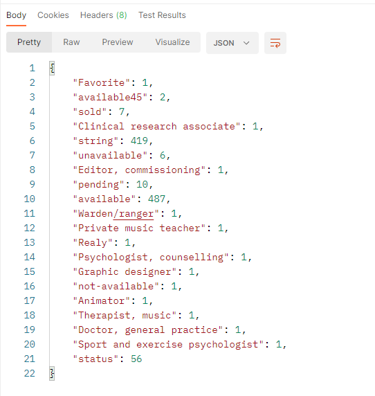

# The Pet Store API Examples

---

## Store Order - POST

<figure>
    
    <figcaption align = "center"><b>Fig.1.1 - Code for Store Order - GET</b></figcaption>
</figure>

<figure>
    
    <figcaption align = "center"><b>Fig.1.2 - Result for Store Order - GET</b></figcaption>
</figure>

---

## Store Order ID - GET

<figure>
    
    <figcaption>Code for Store Order with ID:1</figcaption>
    <figcaption align = "center"><b>Fig.2.1 - Code for Store Order with ID:1</b></figcaption>
</figure>

<figure>
    
    <figcaption align = "center"><b>Fig.2.2 - Result for Store Order with ID:1</b></figcaption>
</figure>

---

## Store Order ID - DELETE

<figure>
    
    <figcaption align = "center"><b>Fig.3.1 - Code for Delete Store Order with ID:1</b></figcaption>
</figure>

<figure>
    
    <figcaption align = "center"><b>Fig.3.2 - Result for Delete Store Order with ID:1</b></figcaption>
</figure>

---

## Store Order Inventory - GET

<figure>
    
    <figcaption align = "center"><b>Fig.4.1 - Code for Store Order Inventory

<figure>
    
    <figcaption align = "center"><b>Fig.4.2 - Result for Store Order Inventory</b></figcaption>
</figure>

---